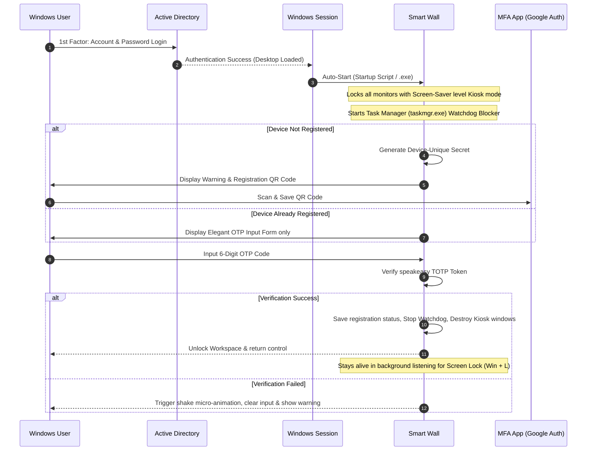
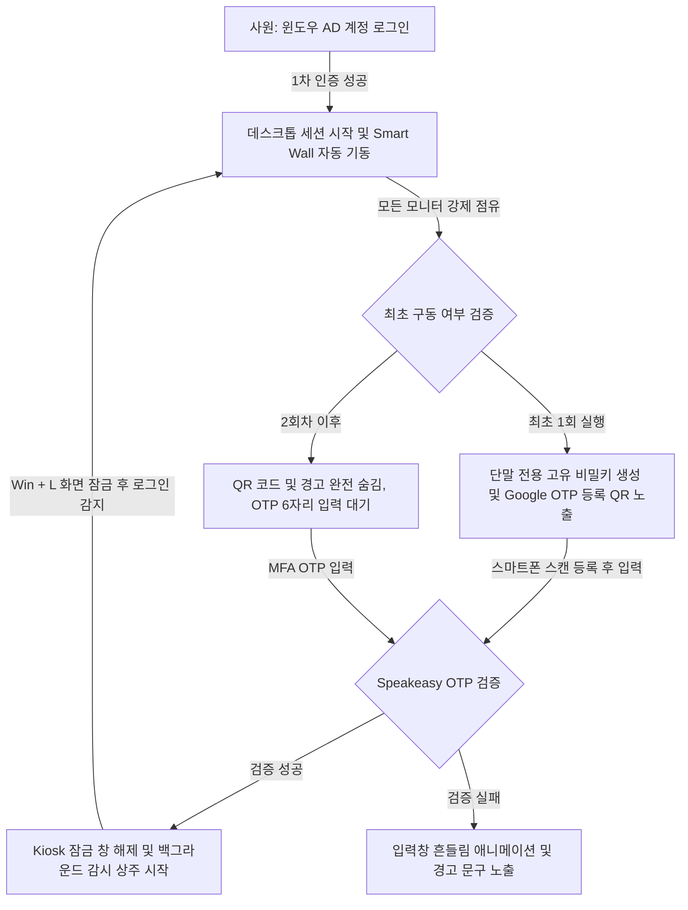

# 📟 Smart Wall (스마트 월)

> **Premium Multi-Factor Authentication (MFA) Kiosk Lock Screen for Enterprise Windows Workstations**
> 
> *윈도우 기업 환경을 위한 초프리미엄 2차 인증(PIN/OTP) 키오스크 보안 락 스크린*

<p align="center">
  
  
  
  
</p>

---

## 🌐 Language Navigation
* [🇺🇸 English Version](#-english)
* [🇰🇷 한국어 버전](#-한국어)

---

# 🇺🇸 English

**Smart Wall** is a high-security, premium-designed kiosk locker application built on Electron. It operates on Windows enterprise environments, prompting users for a secondary Time-based One-time Password (MFA/2FA) immediately after Active Directory (AD) or local credential login. 

Featuring an elegant glassmorphism user interface and advanced anti-bypass watchdogs, **Smart Wall** ensures that workstations remain completely inaccessible to unauthorized parties.

---

## ✨ Key Features

* 📟 **Smart Wall Aesthetics**: Exquisite light-themed UI featuring frosted glassmorphism overlays, soft dynamic mesh pastel gradients, and responsive tactile animations.
* 🔑 **Bespoke 2FA Integration**: Directly hooks into the post-login sequence of Windows Active Directory (AD) logins, acting as a mandatory second-factor verification screen.
* 🔐 **Device-Unique Key Generation**: Every computer autonomously generates a unique 20-character base32 secret upon first launch. Zero master-key risks across the enterprise.
* 🏷️ **Dynamic Authenticator Labeling**: Automatically fetches the Windows Hostname and Motherboard Hardware UUID to label the Google Authenticator account, avoiding any account overlapping (e.g., `Admin@DESKTOP-PC (A9B2E3D4)`).
* 🛡️ **Anti-Hacking Watchdog (Task Killer)**: Actively prevents lock screen bypasses by scanning and terminating the Windows Task Manager (`taskmgr.exe`) every 500ms while locked.
* 🔄 **Windows Session Lock Sync**: Leverages Electron's native `powerMonitor` to continuously listen for Windows session locks (`Win + L`) and re-prompts for MFA immediately upon unlock.
* 🤖 **Developer CLI Tooling**: Quick local state clearing and sandbox recycling via `npm run reset`.

---

## 📊 System Architecture



---

## 🚀 Getting Started

### 📋 Prerequisites
* **OS**: Windows 10 / 11 / Server
* **Runtime**: [Node.js](https://nodejs.org/) (v16+)

### ⚙️ Installation & Development
1. Clone the repository and navigate to the directory:
   ```bash
   git clone https://github.com/yourusername/os-login-kiosk.git
   cd os-login-kiosk
   ```
2. Install dependecies:
   ```bash
   npm install
   ```
3. Run the application in development mode:
   ```bash
   npm start
   ```

### 🗜️ Packaging & Bundling
We support two packaging pipelines for enterprise distribution.

#### [Option A] Lightweight Package (No Admin Rights Required ⭐ Recommended)
Generates an executable folder containing the app and its DLLs. Complete offline capability.
```bash
npm run package
```
* **Output Path**: `dist/Smart Wall-win32-x64/`
* **Distribution**: Copy the entire folder to target workstations via USB or File Server.

#### [Option B] Standalone Portable Executable (Maximum Compression)
Bundles the entire runtime into a single standalone `.exe` using LZMA/7z algorithms.
> [!WARNING]
> *Requires Administrative Privileges on your development terminal during compilation to extract Darwin/macOS symlink assets.*
```bash
# Run your terminal (cmd/PowerShell) as Administrator, then run:
npm run dist
```
* **Output Path**: `dist/Smart Wall.exe`
* **Distribution**: Distribute just the single `.exe` file across workstations.

---

# 🇰🇷 한국어

**Smart Wall (스마트 월)**은 Electron 기반으로 개발된 고보안, 프리미엄 디자인의 키오스크 화면 잠금 애플리케이션입니다. 

Active Directory(AD) 혹은 로컬 Windows 계정 로그인 직후 작동하여 데스크톱 화면 노출 전 **2차 시간 기반 일회용 비밀번호(MFA/2FA OTP) 인증**을 강제합니다. 수려한 글래스모피즘(Glassmorphism) 테마와 강력한 우회 감시 기능을 결합하여, 승인되지 않은 비인가 사용자의 조작을 완벽하게 차단하고 사내 워크스테이션 인프라를 안전하게 수호합니다.

---

## ✨ 핵심 기능

* 📟 **스마트 월 프리미엄 테마**: 유리 질감(Glassmorphism)의 컨트롤 패널, 화사하게 움직이는 파스텔 메쉬 그라디언트 배경, 생동감 있는 물리적 인터랙션 모션을 제공합니다.
* 🔑 **Active Directory 완벽 호환**: 윈도우 계정 로그인 직후 2차 잠금 화면으로 즉시 개입하여 안전하고 편리한 기업형 이중 보안을 구성합니다.
* 🔐 **단말별 고유 비밀키 자체 발급**: 공용 마스터키 방식 대신, 각 컴퓨터가 첫 기동 시 고유한 20자리 Base32 비밀키를 개별 생성하여 로컬에 저장합니다. 하나의 단말기가 해킹되더라도 타 워크스테이션은 완벽히 보호됩니다.
* 🏷️ **중복 없는 스마트폰 계정 매칭**: 기기의 실제 윈도우 호스트네임 및 메인보드 고유 하드웨어 UUID를 자동 결합하여 Google OTP 계정명을 동적 발급하므로 스마트폰 내 중복이나 덮어쓰기 위험이 전혀 없습니다 (예: `Admin@PC-ROOM-01 (8FC2B014)`).
* 🛡️ **작업 관리자 실시간 강제 종료 (Anti-Bypass)**: 화면 잠금 상태에서 작업 관리자(`taskmgr.exe`)의 기동을 백그라운드 상에서 **500ms 간격으로 감지하여 강제 종료**시킴으로써 인증 화면 우회를 완벽히 봉쇄합니다.
* 🔄 **화면 잠금(Win + L) 실시간 감지**: 윈도우 화면 잠금 상태에서 다시 로그인하고 복귀할 때(`unlock-screen`)를 실시간으로 감지하여, 즉시 작업 관리자 감시단을 소집하고 잠금 창을 다시 화면 전체에 덮어씌웁니다.
* 🤖 **개발자 전용 리셋 도구**: 개발 및 샌드박스 테스트 중 OTP 설정 단계를 원클릭으로 초기화하는 `npm run reset` 쉘 스크립트 도구를 탑재했습니다.

---

## 📊 시스템 동작 흐름



---

## 🚀 시작하기

### 📋 필수 소프트웨어
* **OS**: Windows 10 / 11 / Server
* **런타임**: [Node.js](https://nodejs.org/) (v16 이상 권장)

### ⚙️ 로컬 개발 설정
1. 리포지토리를 복사하고 해당 디렉터리로 이동합니다:
   ```bash
   git clone https://github.com/yourusername/os-login-kiosk.git
   cd os-login-kiosk
   ```
2. 필요한 패키지들을 한 번에 설치합니다:
   ```bash
   npm install
   ```
3. 개발 모드로 애플리케이션을 기동하여 실시간 코드를 테스트합니다:
   ```bash
   npm start
   ```

### 🗜️ 패키징 및 단독 실행형 (.exe) 제작
사내 배포의 형태에 맞게 두 가지 강력한 패키징 방식을 지원합니다.

#### [방식 A] 경량형 패키징 (윈도우 권한 에러 없음 ⭐ 적극 권장)
권한 상승 에러나 백신 검사 차단 없이 가장 부드럽고 안전하게 실행용 폴더와 `.exe` 파일을 빌드합니다.
```bash
npm run package
```
* **결과물 경로**: `dist/Smart Wall-win32-x64/`
* **배포 지침**: 생성된 폴더 전체를 압축하거나 그대로 복사하여 USB 드라이브 등을 통해 오프라인 사원 PC에 옮긴 뒤 `Smart Wall.exe`를 실행하십시오.

#### [방식 B] 초압축 단일 포터블 실행 파일 빌드
모든 부속품을 하나의 `.exe` 파일 내부로 LZMA 알고리즘을 이용해 극도로 밀어 넣는 방식입니다.
> [!WARNING]
> *빌드 시 맥용 심볼릭 링크 리소스를 푸는 과정이 수반되므로, **반드시 터미널을 관리자 권한으로 실행**한 뒤 빌드해야 무한 로딩이나 에러가 발생하지 않습니다.*
```bash
# PowerShell/CMD를 우클릭하여 '관리자 권한으로 실행' 후 실행:
npm run dist
```
* **결과물 경로**: `dist/Smart Wall.exe` (또는 `Smart Wall 1.0.0.exe`)
* **배포 지침**: 생성된 단 한 개의 `.exe` 파일만 단독으로 복사하여 사원 PC에 바로 이식할 수 있습니다.

---

## 📄 License
This project is licensed under the MIT License - see the [LICENSE](LICENSE) file for details.